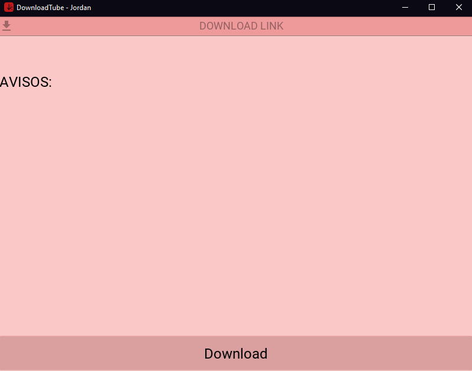

<h1 align="center">
  🖥️<br>DownloadTube
</h1>

<h4 align="center">
  Um aplicativo baseado em GUI simples para baixar vídeos do YouTube.
</h4>

<p align="center"></p>

<h4 align="center"><a href="https://github.com/JordanCampos20/DownloadTube/archive/refs/heads/main.zip">Clique para baixar o projeto</a></h4>

---

## Instalação
```
git clone https://github.com/JordanCampos20/DownloadTube.git
```
```
pip install -r requirements.txt
```

```
Se você tiver python2 e python3, use pip3 ao fazer o download de requirements.txt 
```

## Executando

```
Execute o arquivo "start.bat" para windows
```

---

## 💼 Tecnologias utilizadas
Para o desenvolvimento deste aplicativo utilizei as seguintes tecnologias:

- Python 3.x, Pycharm;

---

## 📚 Bibliotecas Usadas
Para o desenvolvimento deste aplicativo utilizei as seguintes bibliotecas:

- Kivy==2.0.0, KivyMD==0.104.2, YT-DLP==2022.2.4;

---

## 🦄 Autor<br>
<table>
  <tr>
    <td align="center">
      <a href="https://github.com/JordanCampos20">
        <br>
        <sub>
          <b>Jordan C.</b>
        </sub>
      </a>
    </td>
  </tr>
</table>

---
